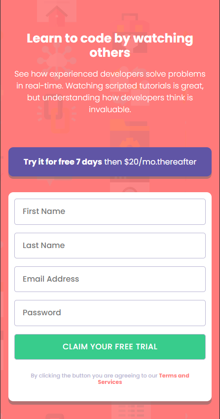

# Intro component with sign up form solution

## Table of contents

- [The challenge](#the-challenge)
- [Screenshot](#screenshot)
- [Links](#links)
- [My process](#my-process)
- [Built with](#built-with)
- [What I learned](#what-i-learned)
- [Continued development](#continued-development)
- [Useful resources](#useful-resources)
- [Author](#author)
- [Acknowledgments](#acknowledgments)

### The challenge

Users should be able to:

- View the optimal layout for the site depending on their device's screen size
- See hover states for all interactive elements on the page
- Receive an error message when the `form` is submitted if:
- Any `input` field is empty. The message for this error should say _"[Field Name] cannot be empty"_
- The email address is not formatted correctly (i.e. a correct email address should have this structure: `name@host.tld`). The message for this error should say _"Looks like this is not an email"_

## Links

[VIEW:DEMO](https://miron-silviu.github.io/Signup-from/)

## Screenshot



## My process

## First Step :

- I created html elements inside index.html file.

## Second Step:

- I styled html elements with mobile first in mind inside style.css
- I linked normalize.css with index.html and style.css

## Third Step

- I the third step a feature branch was created with
- Script.js file was created
- Getting reference to the input field and button
- Create function to validate email using a regular expresion
- Create a function to check if the email is valid
- Add Listener Event

## Built with

- Semantic HTML5 markup
- CSS custom properties
- Flexbox
- CSS Grid
- Mobile-first workflow
- [Styled Components](https://styled-components.com/)

## What I learned

I impoved my knowledeges regarding form input and fieldset. Also took an new style approach.

```html
<input
  class="first-name"
  type="text"
  id="first-name"
  placeholder="First Name"
  required
/>
<label class="first-name-label" for="first-name"
  >First Name cannot be empty</label
>
```

```css
.proud-of-this-css {
  .first-name,
  .second-name,
  .email,
  .password,
  .claim-button {
    padding: 1rem;
    border-radius: 5px;
    border: 1px solid var(--Grayish-Blue);
    color: var(--Dark-Blue);
    font-weight: 500;
    width: auto;
  }
}
```

```js
const proudOfThisFunc = () => {
  const isEmailValid = function (input) {
    const emailPatern = /^[^\s@][+@[^\s@]+\.[^\s@]+$/;
    return emailPatern.test(input);
  };
};
```

## Useful resources

- [Example resource 1](https://www.example.com) - This helped me for XYZ reason. I really liked this pattern and will use it going forward.
- [Example resource 2](https://www.example.com) - This is an amazing article which helped me finally understand XYZ. I'd recommend it to anyone still learning this concept.

**Note: Delete this note and replace the list above with resources that helped you during the challenge. These could come in handy for anyone viewing your solution or for yourself when you look back on this project in the future.**

## Author

- Website - [Add your name here](https://www.your-site.com)
- Frontend Mentor - [@yourusername](https://www.frontendmentor.io/profile/yourusername)
- Twitter - [@yourusername](https://www.twitter.com/yourusername)
